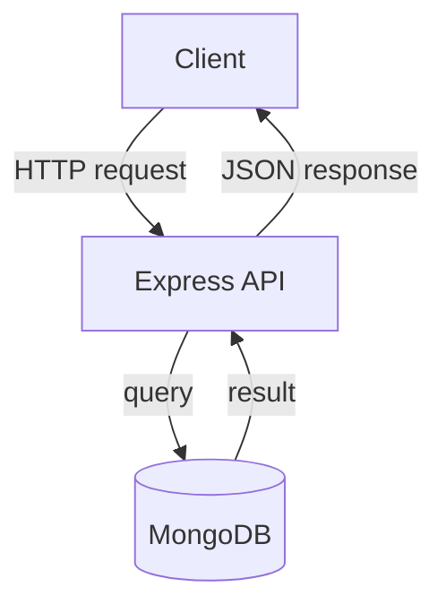
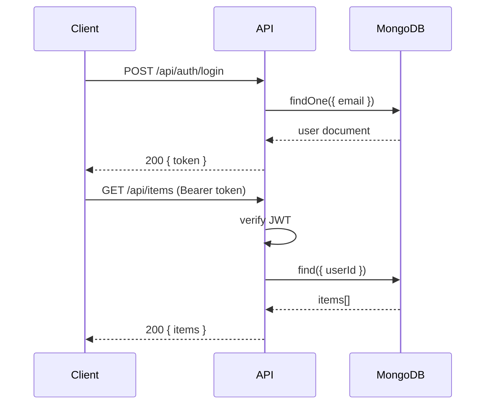
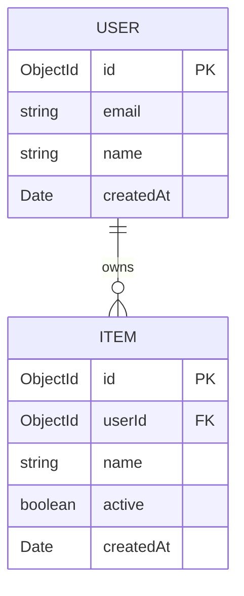
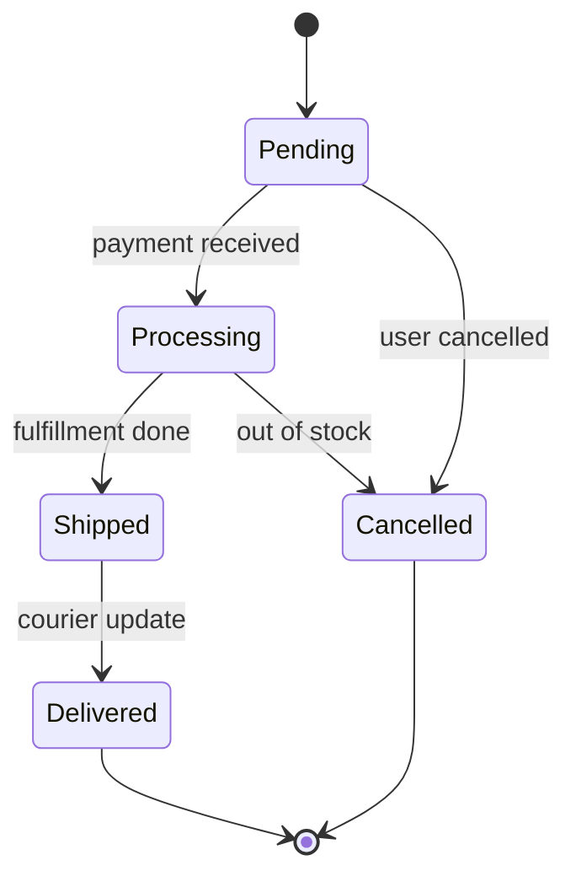

# Scratch

> Edit freely — `temp/` is git-ignored.

---

## Table of Contents

- [Section One](#section-one)
- [Section Two](#section-two)
  - [Subsection](#subsection)
- [Tables](#tables)
- [Code Blocks](#code-blocks)
- [Diagrams](#diagrams)

---

## Section One

Lorem ipsum paragraph. Use `backticks` for inline code, **bold**, _italic_,
~~strikethrough~~, and [links](https://example.com).

- Bullet one
- Bullet two
  - Nested bullet

1. Ordered one
2. Ordered two

> Blockquote for callouts or quotes.

---

## Section Two

### Subsection

| Term      | Definition                        |
| --------- | --------------------------------- |
| `key`     | description of what this key does |
| `another` | another description               |

---

## Tables

### Basic

| Column A | Column B | Column C |
| -------- | -------- | -------- |
| cell     | cell     | cell     |
| cell     | cell     | cell     |

### Alignment

| Left-aligned | Centered | Right-aligned |
| :----------- | :------: | ------------: |
| text         |   text   |          text |
| `code`       | `code`   |        `code` |

### API response example

| Field       | Type     | Required | Description              |
| ----------- | -------- | :------: | ------------------------ |
| `id`        | `string` |    ✓     | MongoDB ObjectId         |
| `name`      | `string` |    ✓     | Display name             |
| `email`     | `string` |    ✓     | Unique email address     |
| `createdAt` | `Date`   |          | Auto-set by Mongoose     |

---

## Code Blocks

### JavaScript / TypeScript

```js
const items = await Item.find({ active: true }).lean();
res.json({ items });
```

```ts
async function getUser(id: string): Promise<User | null> {
  return User.findById(id).lean();
}
```

### Shell

```bash
curl -sf http://localhost:3000/api/items \
  -H "Authorization: Bearer $TOKEN" | jq .
```

```powershell
Invoke-RestMethod http://localhost:3000/api/items `
  -Headers @{ Authorization = "Bearer $env:TOKEN" }
```

### JSON

```json
{
  "name": "example",
  "active": true,
  "tags": ["mern", "node"]
}
```

### YAML

```yaml
services:
  api:
    build: .
    ports:
      - "3000:3000"
    environment:
      MONGO_URI: mongodb://mongo:27017/mydb
  mongo:
    image: mongo:7
```

### Dockerfile

```dockerfile
FROM node:22-alpine AS builder
WORKDIR /app
COPY package*.json ./
RUN npm ci
COPY . .
RUN npm run build

FROM node:22-alpine
WORKDIR /app
COPY --from=builder /app/dist ./dist
COPY --from=builder /app/node_modules ./node_modules
CMD ["node", "dist/server.js"]
```

### MongoDB shell

```js
// find with projection
db.items.find(
  { active: true },
  { name: 1, createdAt: 1 }
).sort({ createdAt: -1 }).limit(10)

// aggregation
db.orders.aggregate([
  { $match: { status: "completed" } },
  { $group: { _id: "$userId", total: { $sum: "$amount" } } },
  { $sort: { total: -1 } }
])
```

### SQL (for reference / migrations)

```sql
SELECT u.id, u.email, COUNT(o.id) AS order_count
FROM users u
LEFT JOIN orders o ON o.user_id = u.id
WHERE u.active = TRUE
GROUP BY u.id
ORDER BY order_count DESC;
```

### HTML

```html
<section class="card">
  <h2>Title</h2>
  <p>Body text with <strong>emphasis</strong>.</p>
  <button type="button">Click me</button>
</section>
```

### CSS

```css
.card {
  display: flex;
  flex-direction: column;
  gap: 1rem;
  padding: 1.5rem;
  border-radius: 0.5rem;
  box-shadow: 0 2px 8px rgb(0 0 0 / 0.08);
}
```

### Environment variables

```dotenv
NODE_ENV=development
PORT=3000
MONGO_URI=mongodb://localhost:27017/mydb
JWT_SECRET=change_me
```

---

## Diagrams

### Flowchart



### Sequence diagram



### Entity relationship



### State machine



---

## Notes

## Links
